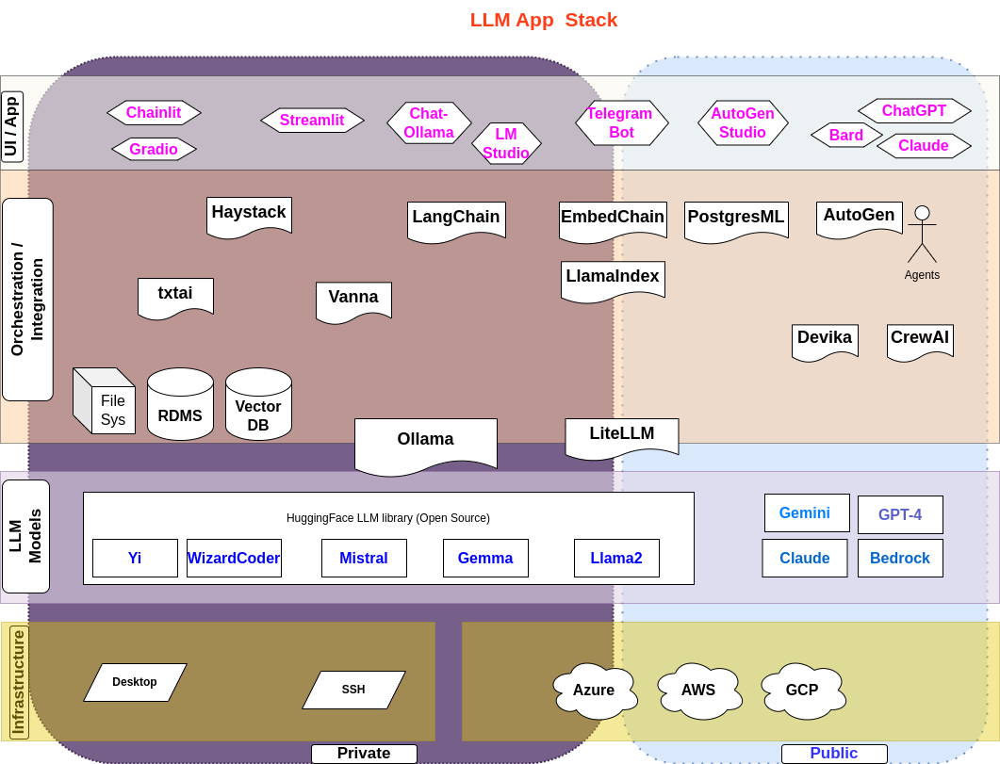
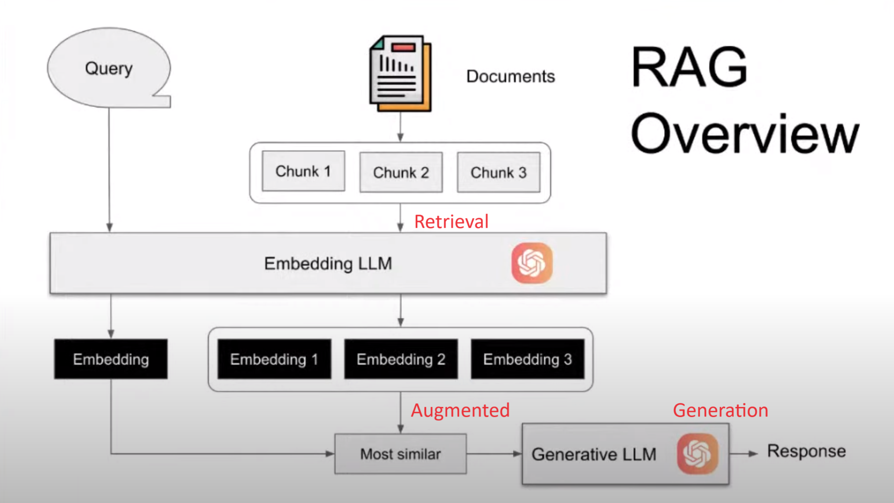
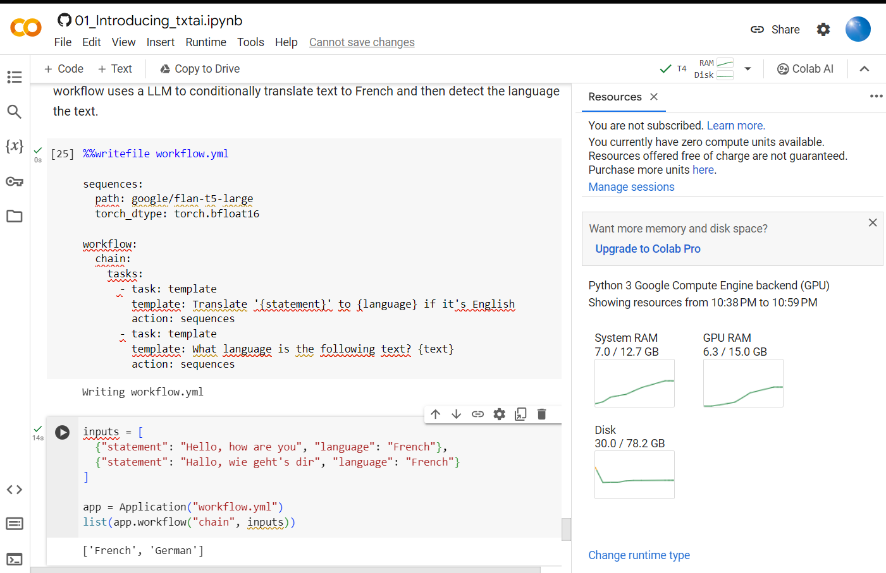

# [LLM](https://www.wikiwand.com/en/Large_language_model) App Framework

## Architecture Diagram


(created in DrawIO)


## Frontend : Human-Machine-Interface

### [Chainlit](https://docs.chainlit.io/get-started/overview)

Build Python LLM apps in minutes 
- Github: https://github.com/Chainlit/chainlit 
- Demo: https://github.com/AI-Maker-Space/Introduction-to-Chainlit

### [Streamlit](https://streamlit.io/)
A faster way to build and share data apps

### [Gradio](https://github.com/gradio-app/gradio)

Build and share delightful machine learning apps, all in Python.
### [chatOllama](https://github.com/wgong/chat-ollama)
~/projects/AI/chat-ollam

### [Ollama-WebUI](https://github.com/ollama-webui/ollama-webui)
ChatGPT-Style Web UI Client for Ollama
- [Docs](https://ollamahub.com/)
- Local: ~/projects/AI/ollama-webui/readme-u1gwg.md
```
conda activate ollama
cd ~/projects/AI/ollama-webui/backend
sh start.sh
```
open browser at URL=http://localhost:8080/


### [ChatBot Ollama](https://github.com/ivanfioravanti/chatbot-ollama)

Chatbot Ollama is an open source chat UI for Ollama.

### [RasaGPT](https://github.com/paulpierre/RasaGPT)
RasaGPT is the first headless LLM chatbot platform built on top of Rasa and Langchain. Built w/ Rasa, FastAPI, Langchain, LlamaIndex, SQLModel, pgvector, ngrok, telegram
- [Docs](https://rasagpt.dev/)

### [AutoGen Studio](https://github.com/microsoft/autogen/tree/main/samples/apps/autogen-studio)
an AutoGen-powered AI app (user interface) to help you rapidly prototype AI agents, enhance them with skills, compose them into workflows and interact with them to accomplish tasks. It is built on top of the AutoGen framework, which is a toolkit for building AI agents

### [LM Studio](https://lmstudio.ai/) (closed)
Discover, download, and run local LLMs

## Mid-Tier : workflow orchestration and service integration

### [AutoGen](https://github.com/microsoft/autogen)

Enable Next-Gen Large Language Model Applications (see also AutoGen studio)

### [OpenDevin](https://github.com/OpenDevin/OpenDevin)

### [Devika][https://github.com/wgong/devika]
Devika is an Agentic AI Software Engineer that can understand high-level human instructions, break them down into steps, research relevant information, and write code to achieve the given objective. Devika aims to be a competitive open-source alternative to Devin by Cognition AI.

- [video](https://www.youtube.com/watch?v=btpnz0WQGvw&t=243s)
- [fork](https://github.com/wgong/devika)


### [CrewAI](https://github.com/joaomdmoura/crewAI)
Framework for orchestrating role-playing, autonomous AI agents. By fostering collaborative intelligence, CrewAI empowers agents to work together seamlessly, tackling complex tasks.

- Setup
```
conda activate autogen
pip install crewai
pip install duckduckgo-search
```

### [LangChain](https://github.com/langchain-ai/langchain)

Building applications with LLMs through composability

### [PostgresML](https://github.com/postgresml/postgresml)
The GPU-powered AI application database. Get your app to market faster using the simplicity of SQL and the latest NLP, ML + LLM models.
- [Homepage](https://postgresml.org/)


### [Haystack](https://github.com/deepset-ai/haystack)

LLM orchestration framework to build customizable, production-ready LLM applications. Connect components (models, vector DBs, file converters) to pipelines or agents that can interact with your data. With advanced retrieval methods, it's best suited for building RAG, question answering, semantic search or conversational agent chatbots.

- [Tutorials](https://github.com/deepset-ai/haystack-tutorials)
- [Demos](https://github.com/deepset-ai/haystack-demos)


#### Building a private GPT with Haystack

- [Part-1: Why+How](https://medium.com/@fvanlitsenburg/building-a-privategpt-with-haystack-part-1-why-and-how-de6fa43e18b)
- [Part-2: Code](https://medium.com/@fvanlitsenburg/building-a-private-gpt-with-haystack-part-2-code-in-detail-7e0dfb9eb3ad)
- [Part-3: use Llama](https://medium.com/@fvanlitsenburg/building-a-private-gpt-with-haystack-part-3-using-llama-2-with-ggml-c2d994da40da)
- [Promptbox](https://github.com/fvanlitsenburg/promptbox)
- [Author-Felix Van Litsenburg](https://medium.com/@fvanlitsenburg)


### [PrivateGPT](https://github.com/imartinez/privateGPT)

Interact with your documents using the power of GPT, 100% privately, no data leaks

-   Docs: https://docs.privategpt.dev/

### [LlamaIndex](https://github.com/run-llama/llama_index)

LlamaIndex (formerly GPT Index) is a data framework for your LLM applications

- Docs: https://docs.llamaindex.ai/
- Examples: https://github.com/run-llama/llama_index/tree/main/docs/examples

### [embedchain](https://github.com/embedchain/embedchain)
- Docs: https://docs.embedchain.ai/


## DB Stores

- [Top 5 Vector DB](https://www.datacamp.com/blog/the-top-5-vector-databases)
- [Vector DB comparisons](https://www.youtube.com/watch?v=zGAkhN1YZXM) by [Kamalraj](https://github.com/Kamalabot)


### [PGVector](https://github.com/pgvector/pgvector)
Open-source vector similarity search for Postgres


### [ChromaDB](https://github.com/chroma-core/chroma)

### [Marqo](https://github.com/marqo-ai/marqo)
multi-modal, multi-linqual vector DB
- https://www.marqo.ai/blog/context-is-all-you-need-multimodal-vector-search-with-personalization

### [FAISS](https://github.com/facebookresearch/faiss)
A library for efficient similarity search and clustering of dense vectors.
- [Docs](https://faiss.ai/)

### [Qdrant](https://github.com/qdrant/qdrant)
High-performance, massive-scale Vector Database for the next generation of AI (implemented in Rust). Also available in the cloud https://cloud.qdrant.io/ 
```
pip install qdrant-client
```

### [Vilvus](https://milvus.io/)

### [Pinecone](https://docs.pinecone.io/docs/quickstart)

### [SQLite-VSS](https://github.com/asg017/sqlite-vss) (no-traction)
A SQLite extension for efficient vector search, based on Faiss

-   sqlite-vss GitHub repository: https://github.com/asg017/sqlite-vss
-   Introducing sqlite-vss: A SQLite Extension for Vector Search: https://observablehq.com/@asg017/introducing-sqlite-vss
-   SQLite-VSS - ️ Langchain: https://api.python.langchain.com/en/latest/vectorstores/langchain.vectorstores.sqlitevss.SQLit

### [MindsDB](https://github.com/mindsdb/mindsdb)
MindsDB connects AI models to real time data

## Backend : interface to various LLM models and resources

### [Ollama](https://ollama.ai/)

Get up and running with Llama 2 and other large language models locally

- local: ~/projects/AI/lighthouse-learning-machine/ollama

### [LiteLLM](https://github.com/BerriAI/litellm)

Call all LLM APIs using the OpenAI format. Use AWS Bedrock, Azure, OpenAI, Cohere, Anthropic, Ollama, Sagemaker, HuggingFace, Replicate (100+ LLMs)

### [vLLM](https://github.com/gongwork/vllm)
A high-throughput and memory-efficient inference and serving engine for LLMs

# Solutions: AI Apps & Use-Cases

## [open-interpreter](https://github.com/KillianLucas/open-interpreter)
A natural language interface for computers, uses `LiteLLM` to connect to hosted LLM


## [llmware](https://github.com/llmware-ai/llmware)

Providing enterprise-grade LLM-based development framework, tools, and fine-tuned models.

## RAG
Neural Search: semantic search, key word search, recommender

### [embedchain](https://github.com/embedchain/embedchain)
Embedchain is an Open Source RAG Framework that makes it easy to create and deploy AI apps

- Docs: https://docs.embedchain.ai/


### Background 

-   [RAG Concept](https://docs.llamaindex.ai/en/stable/getting_started/concepts.html)
-   [10 Ways to Improve RAG](https://towardsdatascience.com/10-ways-to-improve-the-performance-of-retrieval-augmented-generation-systems-5fa2cee7cd5c)
-   [Claude RAG Demo](https://github.com/anthropics/anthropic-retrieval-demo#setting-up-and-using-an-embedding-database)
-   [llamaIndex RAG](https://github.com/run-llama/rags)
-   [llama-coder](https://github.com/ex3ndr/llama-coder)
-   Smart RAG: Domain-specific fine-tuning for end-to-end Retrieval
    -   [Speaker - Greg Loughnane](https://www.linkedin.com/in/gregloughnane/)
    -   [Video](https://www.youtube.com/watch?v=0QaUqoICNBo&t=272s)
    -   [Slide](https://www.canva.com/design/DAFvFEhCJtg/Mthlo-nWXAPck3iK3JaB7Q/edit)
    -   [Code](https://github.com/arcee-ai/DALM/tree/main%20(Domain%20Adapted%20Lang%20Modeling%20Toolkit))
    -   [Company - AI Maker Space](https://github.com/AI-Maker-Space/Fine-tuning-LLM-Resources)
    -   [Paper - Improving the Domain Adaptation of Retrieval Augmented Generation (RAG) Models for Open Domain Question Answering](https://arxiv.org/pdf/2210.02627.pdf)
    -   [LlmOps](https://github.com/AI-Maker-Space/Interactive-Dev-Environment-for-LLM-Development)

- [LlamaIndex Workshop: Multimodal + Advanced RAG Workhop with Gemini](https://www.youtube.com/watch?v=fdpaHJlN0PQ)
    - https://github.com/run-llama/llama_index/tree/main/docs/examples/multi_modal/gemini.ipynb

## Neural-Search

### [txtai](https://medium.com/neuml/introducing-txtai-the-all-in-one-embeddings-database-c721f4ff91ad) 
All-in-one open-source embeddings database for semantic search, LLM orchestration and language model workflows
- [GitHub](https://github.com/neuml/txtai) 
- [Docs](https://neuml.github.io/txtai/)

- Run [Example Notebooks](https://neuml.github.io/txtai/examples/) in Google Colab

## AI Assistant


### [big-AGI](https://github.com/enricoros/big-AGI)

Personal AI application powered by GPT-4 and beyond, with AI personas, AGI functions, text-to-image, voice, response streaming, code highlighting and execution, PDF import, presets for developers, much more. Deploy and gift #big-AGI-energy! Using Next.js, React, Joy.

#### [big-AGI/Ollama](https://github.com/enricoros/big-agi/blob/main/docs/config-ollama.md)

This guide helps you connect Ollama models to big-AGI for a professional AI/AGI operation and a good UI/Conversational experience. The integration brings the popular big-AGI features to Ollama, including: voice chats, editing tools, models switching, personas, and more.

### [Cheshire-Cat](https://github.com/cheshire-cat-ai/core)

Production ready AI assistant framework

### [Amica](https://github.com/semperai/amica)

Amica is an open source interface for interactive communication with 3D characters with voice synthesis and speech recognition.

### Other use-cases
- arXiv research assistant
- Tutors help student learn
- Personal assistants help senior living
- MyLib as personal resource

### AI Data Analyst

- [Pandas AI](https://console.cloud.google.com/home/dashboard?project=pandasai-419903)


```
Project_name: pandasai
Project_number: 124236468554
Project_ID: pandasai-419903
```


- https://github.com/topics/nl2sql

- [Vanna](https://github.com/vanna-ai/vanna)
    - ~/projects/AI/lighthouse-learning-machine/data-analyst/vanna

    - ~/projects/AI/lighthouse-learning-machine/data-analyst/notebooks/sqlite-ollama-chromadb-u1gwg.ipynb
    ```
from vanna.ollama import Ollama
from vanna.chromadb.chromadb_vector import ChromaDB_VectorStore
class MyVanna(ChromaDB_VectorStore, Ollama):
    def __init__(self, config=None):
        ChromaDB_VectorStore.__init__(self, config=config)
        Ollama.__init__(self, config=config)

vn = MyVanna(config={'model': 'mistral'})
file_db = "./db/gpt3sql.sqlite"
vn.connect_to_sqlite(file_db)
df_ddl = vn.run_sql("SELECT type, sql FROM sqlite_master WHERE sql is not null")
for ddl in df_ddl['sql'].to_list():
    vn.train(ddl=ddl)
# DDL statements are powerful because they specify table names, colume names, types, and potentially relationships
vn.train(ddl="""
    CREATE TABLE IF NOT EXISTS my-table (
        id INT PRIMARY KEY,
        name VARCHAR(100),
        age INT
    )
""")
# Sometimes you may want to add documentation about your business terminology or definitions.
vn.train(documentation="Our business defines OTIF score as the percentage of orders that are delivered on time and in full")
# You can also add SQL queries to your training data. This is useful if you have some queries already laying around. You can just copy and paste those from your editor to begin generating new SQL.
vn.train(sql="SELECT * FROM my-table WHERE name = 'John Doe'")
vn.ask(question="How many customers do we have")
    ```

## Local AI-App Development

### [Ollama](https://ollama.ai/)

Get up and running with Llama 2 and other large language models locally

- [python API](https://github.com/ollama/ollama-python)
    - ~/projects/AI/ollama-python

- [Ollama and LangChain: Run LLMs locally](https://medium.com/@abonia/ollama-and-langchain-run-llms-locally-900931914a46)
    - ~/projects/AI/ollama-python/examples/langchain

### [Bionic-GPT](https://github.com/bionic-gpt/bionic-gpt)

BionicGPT is an on-premise replacement for ChatGPT, offering the advantages of Generative AI while maintaining strict data confidentiality

### [chatd](https://github.com/BruceMacD/chatd)

Chat with your documents using local AI

# Development Resources

## IDE
### VS [Code](https://code.visualstudio.com/)

Code editing - Redefined

#### twinny 
VS Code copilot-like extension using ollama

### Google [Colab](https://colab.google/)
Colab is a hosted Jupyter Notebook service that requires no setup to use and provides free access to computing resources, including GPUs and TPUs. Colab is especially well suited to machine learning, data science, and education.


## Productivity Tools

### [DrawIO](https://www.drawio.com/)
has both cloud and desktop versions.

### Google Drive

# Learning Resources

## YouTube channels

| Title                      | URL                                                                                 | GitHub                                        | local                                         | Note |
|---------------|---------------|---------------|---------------|---------------|
| --- | --- | --- | --- | --- |
|The future of Gen AI (Turing Lecture)| https://www.youtube.com/watch?v=2kSl0xkq2lM | --------------- | --------------- | Michael Wooldridge: Director of Foundational AI Research|
| LangChain by Sam Witteveen | https://www.youtube.com/watch?v=3yPBVii7Ct0&list=PL8motc6AQftn-X1HkaGG9KjmKtWImCKJS | https://github.com/samwit/langchain-tutorials | projects\ai\sam\_witeveen\langchain-tutorials |      |
| LLM by Sam Vitteveen       | https://www.youtube.com/watch?v=TEq5Kg4VONA                                         | https://github.com/samwit/llm-tutorials       | projects\ai\sam\_witeveen\llm-tutorials       |      |
| --- | --- | --- | --- | --- |


# Questions
## varieties of General Intelligence
- Machines that can do anything a human can do
- Machines that can do any cognitive task a human can do
- Machines that can do any language-based task that a human can do
- Augmented LLMs assist human with tasks

## Dimensions of General Intelligence
- planning
- commonsense reasoning
- logical reasoning
- abstract reasoning
- problem solving
- natural language processing
- arithmetic
- recall
- theory of mind
- rational menta state
- social reasoning
- manual dexterity & manipulation
- navigation
- proprioception
- vision understanding
- mobility
- audio understanding
- multi-agent coordination
- hand-eye coordination
- ...

# Resources
## Compare GitHub repos by Forks-and-Stars
https://github.com/wgong/py4kids/blob/master/lesson-11-scrapy/github/forks_stars.ipynb


## [UV](https://github.com/astral-sh/uv) 

An extremely fast Python package installer and resolver, written in Rust.

```
## install With pip.
pip install uv

## Create a virtual environment at .venv
uv venv  

## activate the virtual environment
# On macOS and Linux.
source .venv/bin/activate
# On Windows.
.venv\Scripts\activate


## install a package into the virtual environment:
uv pip install flask                # Install Flask.
uv pip install -r requirements.txt  # Install from a requirements.txt file.
uv pip install -e .                 # Install the current project in editable mode.
uv pip install "package @ ."        # Install the current project from disk.
uv pip install "flask[dotenv]"      # Install Flask with "dotenv" extra.


uv pip sync requirements.txt  # Install from a requirements.txt file.


```

## [bun](https://bun.sh/docs)

Bun is an all-in-one toolkit for JavaScript and TypeScript apps. It ships as a single executable called bun.

At its core is the Bun runtime, a fast JavaScript runtime designed as a drop-in replacement for Node.js. It's written in Zig and powered by JavaScriptCore under the hood, dramatically reducing startup times and memory usage.


```
## install
curl -fsSL https://bun.sh/install | bash

bun was installed successfully to ~/.bun/bin/bun 

Added "~/.bun/bin" to $PATH in "~/.bashrc" 

To get started, run: 

  source /home/gongai/.bashrc 
  bun --help 


npm install -g bun  # the last `npm` command you'll ever need
```

# Eval

see `./docs/LLM-Apps-options.ods`

# Source

- ~/projects/wgong/py4kids/lesson-18-ai/st_rag/readme-u1gwg.md
- run `sync_gongwork_st_rag.sh` to push change to `~/projects/gongwork/st_rag/readme-u1gwg.md`

